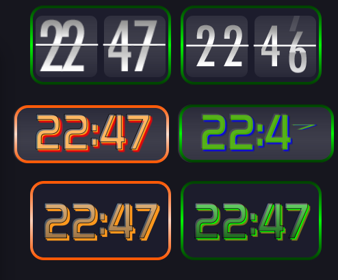

# Conky Digital Clocks

Conky Digital Clocks is a collection of stylish digital clock widgets for your Conky desktop environment. These clocks are designed to be visually appealing and highly customizable.



## Features
- **Animated Flip Clock**: A sleek, animated flip clock widget.
- **Static Digital Clocks**: Several variations of static digital clock designs.
- **Lightweight**: Built primarily using Lua, ensuring efficient performance.
- **Customizable**: Modify colors, fonts, and more to suit your desktop setup.

## Requirements
- **Conky**: Make sure you have Conky installed on your system.
- **Lua**: Required for running the clock scripts.

## Installation
1. Clone this repository:
   ```bash
   git clone https://github.com/wim66/conky-digital-clocks.git
   ```

## Usage
- Select the clock style you want to use.
- Modify the Conky configuration file to include the clock script.
- Restart Conky to apply the changes.

## License
This project is licensed under the MIT License. See the [LICENSE](LICENSE) file for more details.

## Contributing
Contributions are welcome! Feel free to fork the repository and submit pull requests.

## Author
Developed by [wim66](https://github.com/wim66).
Flip clock animations provided by u/Logansfury (Reddit)